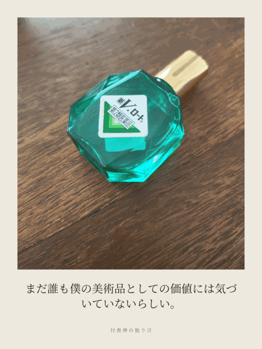

# 付喪神の独り言

**ものに、耳を澄ます。**

身の回りの物を撮ると、その物に宿る付喪神が、誰にも聞かせるつもりのなかった独り言を一つだけ漏らすPWAです。

<p align="center">
  
</p>

## 公開アプリ

[付喪神の独り言を開く](https://tsukumogami-monologue.sunny-seed-0354.chatgpt.site)

## 特徴

- カメラで撮影、または端末の写真を選択
- 画像の状態や置かれ方をAIが読み取り、優しく少しずれた独り言を生成
- 同じ写真からの再生成は行わない、一度きりの体験
- 写真と独り言を1080 × 1440pxのPNGとして保存
- 保存名は日時入りで毎回変化
- 過去の作品を端末内の「付喪録」に保存
- ホーム画面へ追加できるPWA
- OpenAI APIキーを自分で設定するBYOK方式

## 独り言の方向性

悪口や強い皮肉ではなく、付喪神ならではの勘違い、妙な自尊心、人間との認識のずれでクスッとさせます。

> 名前を書かれた。どうやら出世したらしい。

## 使い方

1. 右上の「API設定」を開く
2. OpenAI APIキーを入力する
3. 「物を撮る」または「写真から選ぶ」を押す
4. 「独り言を聞く」を押す
5. 気に入った一枚をPNGで保存する

APIキーはブラウザの端末内にのみ保存されます。

## ローカル起動

```bash
npm install
npm run dev
```

## 技術構成

- React / TypeScript
- OpenAI Responses API（画像入力）
- Canvas API（PNG生成）
- Service Worker / Web App Manifest

## ライセンス

個人制作作品です。無断転載・再配布はご遠慮ください。
